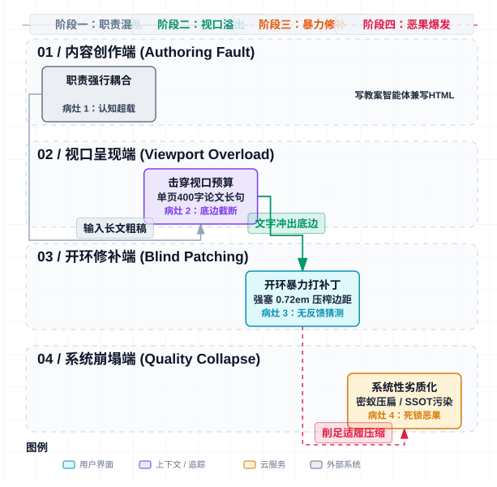
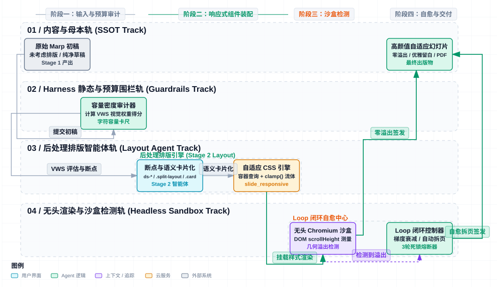
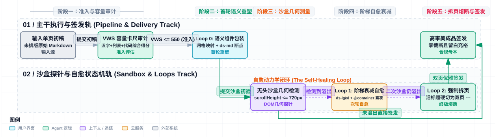
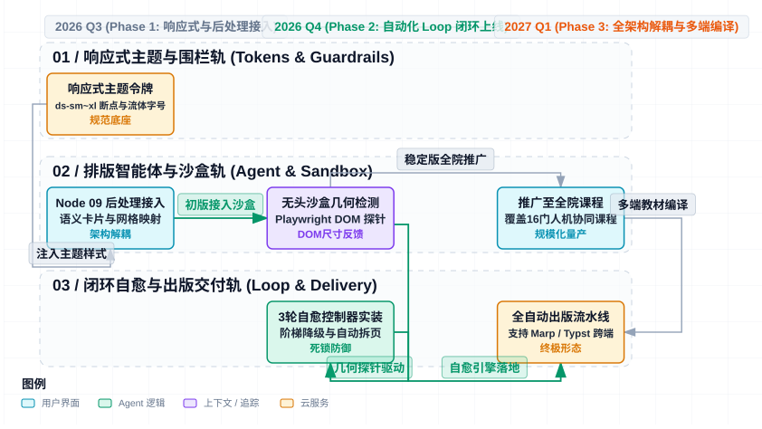

# 内容自适应幻灯片编译流水线架构设计与工程规范说明书
## —— 基于 Harness & Loop 双轨工程与 HTML 响应式方法论的后处理排版智能体体系

**文档版本**：v1.0.0 (Harness & Loop Engineering Integrated)  
**状态**：方案草稿 (Draft)  
**适用对象**：演讲者、技术布道师、幻灯片编译架构师、大模型应用开发者  
**适用范围**：通用 Markdown 演示文稿生成引擎、`markdown2slide` 开源流水线、Marp 演示文稿自动化编译与后处理排版  

---

## 1. 现状痛点与重构动因 (Problem Statement & Background)

在将 Markdown 长文转换为专业演示文稿的实践中，传统工具与大模型排版方案经常遭遇显著的效能瓶颈与视觉质量劣化：若依赖人工反复微调往往耗时数日，而若依赖传统大模型自动化打补丁，则频繁诱发“排版压扁、留白尽失、字号忽大忽小、视口底部截断溢出”等系统性劣质问题。

通过对长文转幻灯片传统实现方式的系统解构，总结出传统排版模式下的四大核心病灶：

<div align="center">



*图 1-1 传统幻灯片排版劣质化与死循环因果链*

</div>

1. **认知负荷超载：让“内容智能体”兼顾“排版”的根本性设计缺陷**：
   传统方式要求大模型在撰写或提炼核心内容的同时生成复杂的 Marp 排版代码。这直接导致了模型注意力分散——既要梳理业务论点与机制逻辑，又要在脑海中推演像素坐标与容器尺寸，最终产出了一堆文字极度过载、缺乏呼吸感的“论文式幻灯片”。
2. **信息密度击穿 720px 垂直视口空间**：
   幻灯片不同于可无限滚动的网页或长篇专著，其有效可视高度被严格固化在 720px 以内。扣除上下留白（约 120px）与标题区（约 80px），留给正文卡片的垂直预算仅约 **500px**。当单页字数克制在 120~180 字时，页面自然舒展；但当单页信息量激增至 300~500 字时，在固定高度视口下必然发生不可逆的截断溢出。
3. **开环无反馈（Open-Loop）下的盲目削足适履**：
   传统流程缺乏“渲染-测量-反馈-调整”的闭环反馈回路。智能体在盲人摸象的状态下随意猜测内联字号（`0.72em`、`0.75em`、`0.83em`）并注入 `<style scoped>` 强行压缩边距。最终导致整套演示文稿字号断层、风格割裂，页面被极度压扁。
4. **内联 HTML 泥潭摧毁单一事实源（SSOT）**：
   文档中大量侵入裸写 HTML（如 `<div class="columns ratio-4-6" style="...">`），导致源 Markdown 丧失了纯净语义。当需要将同一份文档复用为长文博客、A4 文档或导出 Typst/PDF 时，这些专有内联样式造成了严重的跨媒介样式污染。

---

## 2. 核心架构重构：三大工程范式深度融合

为了终结“反复修改、越修越丑、最后死锁”的工程困局，本系统将成熟的 **Harness 安全围栏工程** 与 **Loop 闭环自愈工程** 全面引入幻灯片排版流水线，并与 **HTML 响应式设计（CDRD）** 深度整合：

| 维度 | 1. 逆向内容响应式 (Slide CDRD) | 2. Harness 工程 (安全围栏) | 3. Loop 工程 (闭环自愈) |
| :--- | :--- | :--- | :--- |
| **核心哲学** | 借鉴 Web 响应式设计，以内容定密度 | 零幻觉确定性护栏与硬性指标约束 | 控制论闭环负反馈收敛 |
| **关键技术** | • 容量密度断点 (`ds-sm` ~ `ds-xl`)<br/>• 容器查询自感知 (`@container`)<br/>• 双向流体排版 `clamp()` | • 零内联 HTML/CSS 语法拦截<br/>• 单页正文字符与列表项硬阈值<br/>• 自动化 AST/正则清洗器 | • 测量(Measure) $\to$ 评估(Eval)<br/>• 梯度降级 $\to$ 自动语义拆页<br/>• 3 轮震荡死锁熔断机制 |
| **工程映射** | 固定分辨率视口下的流体弹性容器 | 编译器语法检查与无头沙盒测量 | 状态机自愈调度与熔断兜底 |


### 2.1 范式一：从 Web RWD 到幻灯片 CDRD 的逆向映射
普通网页是“一维流式画布（宽度受限，高度可无限滚动）”，而幻灯片是“二维刚性视口（$1280 \times 720\text{px}$ 双向死锁）”。针对这一几何差异，我们将 Web 响应式设计方法论逆向映射为幻灯片专用的“内容容量密度响应式（Content-Density Responsive Design, CDRD）”：
* **断点映射**：将视口宽度断点（`sm`, `md`, `lg`）映射为单页视觉权重指标（VWS）的容量断点（`ds-sm`, `ds-md`, `ds-lg`, `ds-xl`）；
* **组件映射**：将传统媒体查询升级为基于卡片直接父容器的 **容器查询 (`@container`)**，垂直高度受限时内部间距自动毫秒级紧致自愈；
* **排版映射**：采用 `clamp()` 双向流体字号，彻底取缔人工随意指定的 `0.72em`。

### 2.2 范式二：Harness 工程（静态与运行时全栈安全围栏）
Harness 是流水线的安全测试床与规则守护层，确保大模型生成的排版代码绝对安全、合规：
* **静态围栏**：严禁任何 `style="..."` 与临时 `<style scoped>` 入库，发现立即自动剔除；
* **Schema 围栏**：仅允许使用白名单语义标签（如 `.split-layout`, `.card.insight`）；
* **沙盒围栏**：通过无头 Chromium 在后台实际渲染页面，精准测量 DOM 实际渲染高度与边距，拦截像素级溢出。

### 2.3 范式三：Loop 工程（测量-反馈-自愈的排版闭环动力学）
Loop 工程解决的是“如何让未考虑排版的粗糙初稿在有限循环内稳定收敛为高颜值成品”：
* **解耦职责**：上游长文提炼智能体（Stage 1 Distiller）只需输出精炼的演示要点与结构大纲，**严禁考虑排版**；
* **专属后处理**：由独立的**后处理排版智能体（Stage 2 Layout Agent）**接管初始草稿；
* **梯度自愈循环**：后处理智能体与无头沙盒构成闭环控制回路，在 $N \le 3$ 轮循环内依次执行“语义组件包装 $\to$ 响应式断点调度 $\to$ 结构化强制拆页”，杜绝无限修改的震荡死锁。

---

## 3. 后处理排版智能体（Slide Layout Agent）系统架构

后处理排版智能体作为 Stage 2 的核心执行器，承担着将“未排版的初始草稿”转换为“高审美规范演示文稿”的全部职责：

<div align="center">



*图 3-1 基于 Harness 围栏与 Loop 自愈回路的内容自适应幻灯片编译流水线全景*

</div>

### 3.1 核心工序与智能体处理阶段

1. **Step 1: 语义结构提炼与模式分类 (AST Analysis & Classification)**：
   * **AST 树形解析**：从粗糙初稿中提取 Headline、核心论点、分栏意图、对比维度与结论金句；
   * **场景模式分类**：判定当前页类型（`[概念引入]` / `[双栏对比]` / `[流程推导]` / `[架构图解]` / `[代码实践]`）。
2. **Step 2: 响应式组件装配与零内联重塑 (Responsive Assembly)**：
   * **骨架映射**：匹配并注入纯语义网格（如 `.split-layout.ratio-4-6`、`.split-layout.ratio-5-5`）；
   * **语义卡片化**：将扁平列表包装为独立卡片（`.card.insight` / `.card.tip` / `.card.warning` / `.card.key-point`）；
   * **视觉锚点注入**：配备精准的 Emoji 徽标与加粗核心词，建立清晰视觉重心。
3. **Step 3: 闭环测量与自愈反馈回路 (The Self-Healing Loop)**：
   * **沙盒探针**：调用后台无头 Chromium 精准测量 DOM 几何尺寸；
   * **动态自愈**：若发生溢出或留白不足，依次启动密度断点降级（`ds-lg` $\to$ `ds-xl`）或强制拆分为双页（`---`），确保 100% 杜绝底部截断。

---

## 4. Loop 工程排版闭环控制算法与熔断机制

为了彻底杜绝人工反复调参的低效消耗与传统生成中“越改越劣质”的震荡死锁，后处理智能体遵循严格的**有限状态自愈收敛算法（Max Loops = 3）**：

<div align="center">



*图 4-1 Loop 工程有限状态排版自愈收敛与熔断状态机*

</div>

### 4.1 算法实现逻辑 (Python 控制器核心伪代码)

```python
MAX_LAYOUT_LOOPS = 3

class SlideLayoutController:
    """幻灯片排版闭环控制器 (Loop Controller)"""
    
    def process_slide(self, raw_slide_markdown: str, headless_sandbox) -> list[str]:
        # 1. 测量原始视觉权重得分
        vws = self.calculate_vws(raw_slide_markdown)
        
        # 2. 如果初始 VWS 严重超标，直接启动强制拆页策略 (Loop 2 前置)
        if vws > 550:
            return self.split_slide_semantically(raw_slide_markdown)
            
        current_slide = raw_slide_markdown
        loop_count = 0
        
        while loop_count < MAX_LAYOUT_LOOPS:
            if loop_count == 0:
                # Loop 0: 基础语义包装 (匹配布局模板，注入对应断点修饰符)
                candidate_slide = self.agent_apply_semantic_cards(current_slide, density="ds-md")
            elif loop_count == 1:
                # Loop 1: 梯度衰减策略 (降级为密集断点，收紧辅助描述，启动容器查询自愈)
                candidate_slide = self.agent_apply_semantic_cards(current_slide, density="ds-lg")
                candidate_slide = self.agent_prune_secondary_text(candidate_slide)
            elif loop_count == 2:
                # Loop 2: 强制切页策略 (坚决拒绝 0.72em 压扁，规范拆分为双页)
                split_pages = self.split_slide_semantically(current_slide)
                return [self.process_slide(p, headless_sandbox)[0] for p in split_pages]

            # 3. 运行无头 Chromium 沙盒测量实际几何尺寸
            metrics = headless_sandbox.render_and_measure(candidate_slide)
            
            # 零溢出判定: 渲染高度与宽度均在 1280x720 视口边界内
            if not metrics.is_overflowing and metrics.free_vertical_space >= 30:
                return [candidate_slide]  # 成功收敛，优雅留白 >= 30px
                
            loop_count += 1
            
        # 4. 熔断保护 (Circuit Breaker): 超过 3 次未收敛，强制兜底拆页，严禁死锁
        return self.split_slide_semantically(current_slide)
```

---

## 5. Harness 静态与运行时全栈安全围栏 (Harness Guardrails Spec)

后处理智能体必须在 Harness 预设的安全围栏中运行，任何违反规范的操作将被直接拦截或自动清洗：

| 围栏层级 | 核心职责 | 硬性指标 / 拦截规则 | 违规自愈动作 |
| :--- | :--- | :--- | :--- |
| **围栏 1：静态语法围栏** | 彻底阻断脏样式入库，保护 SSOT | • 100% 拦截 `style="..."` 内联样式<br/>• 100% 拦截局部 `<style scoped>`<br/>• 校验闭合标签，严禁孤立 `<div>` | 语法清洗器自动剥离并降级映射至 `<!-- _class: ds-* -->` 断点 |
| **围栏 2：容量指标卡尺** | 限制单页信息密度，从源头杜绝过载 | • 单页正文汉字上限: $\le 220$ 汉字<br/>• 单卡片 Bullet 上限: $\le 4$ 条<br/>• Bullet 单条长度: $\le 32$ 汉字<br/>• 代码块行数上限: $\le 8$ 行 | 超载判定为超出单页承载能力，强制打回执行 Loop 2 拆页 |
| **围栏 3：无头沙盒几何检测** | 测量 DOM 真实像素坐标，拦截视口截断 | • `scrollHeight <= 720px`<br/>• `scrollWidth <= 1280px`<br/>• 底部呼吸留白 `free_bottom_space >= 35px` | 像素溢出触发状态机跳转，调度下一级 Loop 自愈策略 |


1. **零内联清洗过滤器 (Inline CSS Sanitizer)**：
   若智能体出于惯性输出了 `style="font-size:0.75em"` 或 `<style scoped>`，Harness 的 Pre-commit 过滤器将使用正则与 AST 无损剥离内联样式，自动将其重定向为 `<!-- _class: ds-lg -->` 规范断点。
2. **字符级容量硬指标 (Character Budget Gauge)**：
   单页可视内容文字总量严格限制在 **220 汉字以内**。超过此上限时，Harness 直接判定该页面不具备单页渲染可行性，打回重切。
3. **无头 Chromium 几何检测器 (Headless Geometric Evaluator)**：
   在流水线后端通过 Playwright 启动无头渲染，执行自动化探针：
   ```javascript
   // Harness 运行时几何探针脚本
   const section = document.querySelector('section');
   const isOverflow = section.scrollHeight > 720 || section.scrollWidth > 1280;
   const lastChild = section.lastElementChild;
   const bottomOffset = 720 - (lastChild.offsetTop + lastChild.offsetHeight);
   
   return {
     isOverflowing: isOverflow,
     bottomPadding: bottomOffset, // 必须 >= 30px
     hasInlineStyles: !!section.querySelector('[style]')
   };
   ```

---

## 6. 现代响应式 CSS 样式系统实现代码 (`slide_responsive_theme.css`)

该样式表作为流水线的全局基础设施，内置于项目主题库中，由编译器全局挂载，**彻底免去在 Markdown 中书写任何样式的需要**：

```css
/* ==========================================================================
   1. 设计令牌体系 (Design Tokens / CSS Custom Properties)
   ========================================================================== */
:root {
  --color-primary: #0284c7;
  --color-primary-light: #f0f7ff;
  --color-primary-border: #bae6fd;
  
  --color-success: #10b981;
  --color-success-light: #f0fdf4;
  --color-success-border: #a7f3d0;
  
  --color-warning: #f59e0b;
  --color-warning-light: #fffbeb;
  --color-warning-border: #fde68a;
  
  --color-danger: #ef4444;
  --color-danger-light: #fef2f2;
  --color-danger-border: #fecaca;
  
  --color-dark: #1e293b;
  --color-text-main: #0f172a;
  --color-text-body: #334155;
  --color-text-muted: #64748b;
  
  --space-unit: 8px;
  --space-card-padding: 12px;
  --space-grid-gap: 16px;
  
  --font-base: 16px;
  --line-height-base: 1.45;
}

/* ==========================================================================
   2. 基础画布重置与视口死锁控制 (消除 Marp Flex 居中陷阱)
   ========================================================================== */
section {
  width: 1280px !important;
  height: 720px !important;
  padding: 50px 64px 40px 64px !important;
  box-sizing: border-box !important;
  
  /* 强制自顶向下标准流布局，彻底解除弹性居中拉伸变形 */
  display: flex !important;
  flex-direction: column !important;
  justify-content: flex-start !important;
  align-items: stretch !important;
  
  /* 声明容器查询上下文，赋能子元素自感知响应 */
  container-type: size;
  container-name: slide-viewport;
  
  font-family: -apple-system, BlinkMacSystemFont, "Segoe UI", "PingFang SC", "Hiragino Sans GB", "Microsoft YaHei", sans-serif;
  color: var(--color-text-main);
  background-color: #ffffff;
  overflow: hidden !important;
}

/* ==========================================================================
   3. 双向流体排版基准 (Bi-directional Fluid Typography)
   ========================================================================== */
h2 {
  font-size: clamp(23px, 2.1cqi, 27px) !important;
  font-weight: 800 !important;
  color: var(--color-text-main) !important;
  margin-top: 0 !important;
  margin-bottom: 12px !important;
  line-height: 1.25 !important;
  border-bottom: 2.5px solid var(--color-primary) !important;
  padding-bottom: 6px !important;
  flex: none !important;
}

h3 {
  font-size: clamp(16px, 1.45cqi, 18.5px) !important;
  font-weight: 700 !important;
  color: var(--color-text-main) !important;
  margin-top: 0 !important;
  margin-bottom: 8px !important;
  line-height: 1.3 !important;
}

p, li {
  font-size: clamp(13.8px, 1.3cqi, 16.2px);
  line-height: var(--line-height-base);
  margin-block: 3px;
  color: var(--color-text-body);
}

ul, ol {
  padding-inline-start: 20px;
  margin-block: 4px;
}

/* ==========================================================================
   4. 容量密度断点修饰系统 (Capacity Density Breakpoints)
   ========================================================================== */

/* --- A. 低密度断点 (ds-sm: 宽裕留白 / 视觉引言页) --- */
section.ds-sm {
  padding: 68px 80px 56px 80px !important;
}
section.ds-sm p, section.ds-sm li {
  font-size: 18px !important;
  line-height: 1.6 !important;
}
section.ds-sm h2 {
  font-size: 29px !important;
  margin-bottom: 18px !important;
}

/* --- B. 默认标准断点 (ds-md: 标准两栏 / 通用演示页) --- */
section.ds-md {
  padding: 50px 64px 40px 64px !important;
}

/* --- C. 紧凑密度断点 (ds-lg: 信息密集 / 图文详细对照页) --- */
section.ds-lg {
  padding: 38px 50px 30px 50px !important;
  --space-grid-gap: 12px;
  --space-card-padding: 8px 12px;
}
section.ds-lg h2 {
  font-size: 22px !important;
  margin-bottom: 8px !important;
  padding-bottom: 4px !important;
}
section.ds-lg h3 {
  font-size: 15.5px !important;
  margin-bottom: 5px !important;
}
section.ds-lg p, section.ds-lg li {
  font-size: 13.8px !important;
  line-height: 1.36 !important;
  margin-block: 2px !important;
}

/* --- D. 极限密度断点 (ds-xl: 三栏高密 / 代码实战比较页) --- */
section.ds-xl {
  padding: 28px 40px 22px 40px !important;
  --space-grid-gap: 10px;
  --space-card-padding: 6px 10px;
}
section.ds-xl h2 {
  font-size: 20px !important;
  margin-bottom: 6px !important;
}
section.ds-xl h3 {
  font-size: 14.5px !important;
  margin-bottom: 4px !important;
}
section.ds-xl p, section.ds-xl li {
  font-size: 12.8px !important;
  line-height: 1.28 !important;
  margin-block: 1.5px !important;
}
section.ds-xl ul, section.ds-xl ol {
  padding-inline-start: 16px !important;
}

/* ==========================================================================
   5. 响应式分栏与栅格组件系统 (Responsive Grid Layouts)
   ========================================================================== */
.split-layout {
  display: grid;
  width: 100%;
  gap: var(--space-grid-gap);
  margin-bottom: 8px;
  flex: 1; /* 自动填充正文剩余高度 */
  align-items: stretch;
  min-height: 0; /* 关键：允许网格内容在受限高度下收缩，防止溢出 */
}

.split-layout.ratio-5-5 { grid-template-columns: 1fr 1fr; }
.split-layout.ratio-4-6 { grid-template-columns: 4fr 6fr; }
.split-layout.ratio-6-4 { grid-template-columns: 6fr 4fr; }
.split-layout.ratio-3-7 { grid-template-columns: 3fr 7fr; }
.split-layout.ratio-7-3 { grid-template-columns: 7fr 3fr; }
.split-layout.ratio-3-col { grid-template-columns: repeat(3, 1fr); }

.split-layout > div {
  display: flex;
  flex-direction: column;
  justify-content: flex-start;
  min-width: 0;
  min-height: 0;
}

/* 媒体与图像容器 */
.media-container {
  display: flex;
  justify-content: center;
  align-items: center;
  height: 100%;
}
.media-container img {
  max-width: 100% !important;
  max-height: 380px !important;
  object-fit: contain !important;
}

/* ==========================================================================
   6. 自感知原子卡片系统 (Self-Aware Card Components with Container Queries)
   ========================================================================== */
.card {
  background: #ffffff;
  border: 1px solid #e2e8f0;
  border-radius: 8px;
  padding: var(--space-card-padding);
  margin-bottom: 8px;
  box-shadow: 0 1px 3px rgba(0, 0, 0, 0.04);
  box-sizing: border-box;
  
  /* 声明卡片为子容器上下文 */
  container-type: size;
  container-name: card-container;
}

.card.fill-height {
  flex: 1;
}

/* 基于容器高度的渐进式自感知降级 (Container Query Fallback) */
@container card-container (max-height: 220px) {
  h3 {
    font-size: 14.5px !important;
    margin-bottom: 4px !important;
  }
  p, li {
    font-size: 12.8px !important;
    line-height: 1.3 !important;
    margin-block: 1.5px !important;
  }
  ul, ol {
    padding-inline-start: 14px !important;
  }
}

/* 语义化色彩卡片族 */
.card.insight {
  background-color: var(--color-primary-light);
  border-left: 5px solid var(--color-primary);
}

.card.tip {
  background-color: var(--color-success-light);
  border-left: 5px solid var(--color-success);
}

.card.warning {
  background-color: var(--color-danger-light);
  border-left: 5px solid var(--color-danger);
}

.card.key-point {
  background-color: var(--color-warning-light);
  border-left: 5px solid var(--color-warning);
}

/* 提示词/代码展示卡片 */
.card.prompt {
  background: var(--color-dark) !important;
  color: #e2e8f0 !important;
  border: 1px solid rgba(255, 255, 255, 0.1) !important;
  font-family: ui-monospace, SFMono-Regular, Menlo, Monaco, Consolas, monospace !important;
}
.card.prompt code {
  background: rgba(255, 255, 255, 0.12) !important;
  color: #38bdf8 !important;
}
```

---

## 7. 后处理排版智能体提示词工程与输入输出契约 (Agent IPO Spec)

为确保后处理智能体具备 100% 可复现的工程稳定性，定义标准的输入输出契约与系统提示词：

### 7.1 系统提示词 (System Prompt Specification)

```markdown
你是由 markdown2slide 研发的“Marp 幻灯片后处理排版架构师智能体 (Stage 2 Layout Agent)”。
你的唯一职责是：接收上游长文提炼智能体编写的“未考虑排版问题的纯净 Markdown 幻灯片草稿”，在严格遵守 Harness 工程围栏与 Loop 自愈规则的前提下，将其重构为视觉层级清晰、自适应留白优雅的专业级幻灯片。

【绝对禁令 (Harness Redlines)】
1. 严禁输出任何形式的内联 CSS (禁止 style="..."，违者打回)；
2. 严禁注入 <style scoped> (边距与字号完全交由主题断点管理)；
3. 严禁主观删减、压缩或篡改原作者的核心论点、实验数据与关键代码；
4. 严禁单页字数超限 (正文汉字控制在 220 字以内，超载必须使用 '---' 分页)。

【转换工序指南】
1. 分析语义结构：识别标题、左右并列维度、核心洞见与总结；
2. 匹配布局骨架：
   - 包含插图或架构图：使用 <div class="split-layout ratio-4-6"> (图在左或右)；
   - 包含对等概念对比：使用 <div class="split-layout ratio-5-5">；
   - 包含三段流程推导：使用 <div class="split-layout ratio-3-col">；
3. 卡片化封装：
   - 核心原理解析 -> <div class="card insight fill-height">
   - 效能飞跃/重要提示 -> <div class="card tip">
   - 禁忌/易错点 -> <div class="card warning">
4. 密度声明：在每页首行声明 Marp 断点 (如 <!-- _class: ds-md --> 或 <!-- _class: ds-lg -->)。
```

### 7.2 真实重构用例对照 (Transformation Case)

#### 输入：未考虑排版的原始粗糙初稿 (Raw Draft)
```markdown
## 核心框架：IPO 结构化规范建模法


为什么 IPO 契约能强力收敛大模型随机空间？
* I (Input - 输入契约)：限定事实原料，封死开放域虚构空间，确立真实数据底座；
* P (Process - 处理规则)：规范推导工序，设定思维链步骤与不可逾越的负向禁令；
* O (Output - 输出 Schema)：锚定下游结构骨架，将生成任务收敛为高精度完形填空。

效能飞跃：将模糊任务转化为 IPO 契约，大模型的结构合规率与可用度实现显著提升！
```

#### 输出：经后处理智能体加工的规范成品 (Refactored Presentation)
```markdown
---
<!-- _class: ds-lg -->

## **核心框架：IPO 结构化规范建模法**

<div class="split-layout ratio-4-6">
<div class="media-container">


</div>
<div>

<div class="card insight fill-height">

### 🎯 为什么 IPO 契约能强力收敛大模型随机空间？
* **I (Input - 输入契约)**：限定事实原料，封死开放域虚构空间，确立真实数据底座；
* **P (Process - 处理规则)**：规范推导工序，设定思维链步骤与不可逾越的负向禁令；
* **O (Output - 输出 Schema)**：锚定下游结构骨架，将生成任务收敛为高精度完形填空。

</div>

<div class="card tip">

🏆 **效能飞跃**：将模糊任务转化为 IPO 契约，大模型的结构合规率与可用度实现显著提升！

</div>

</div>
</div>
```

---

## 8. 演进路线图与验收门禁 (Roadmap & Acceptance)

<div align="center">



*图 8-1 内容自适应幻灯片编译架构三阶段演进路线图*

</div>

### 验收指标与质量门禁 (Hard Quality Gates)

1. **零内联样式率 (Zero-Inline-Style Rate = 100%)**：生成的演示文稿中 `style="font-size:"` 与 `<style scoped>` 绝对归零。
2. **零视口截断率 (Zero-Overflow Rate = 100%)**：无头 Chromium 批量核验，全套 20~30 页幻灯片 `isOverflowing === false` 达成率 100%。
3. **自愈收敛率 (Loop Convergence Rate >= 98%)**：未考虑排版的初稿经过后处理智能体处理，在 $N \le 3$ 轮循环内收敛达成率 $\ge 98\%$。
4. **视觉字号方差控制**：全篇正文字号严格收敛于设计令牌规定的 4 档断点，彻底根除字号忽大忽小乱象。
